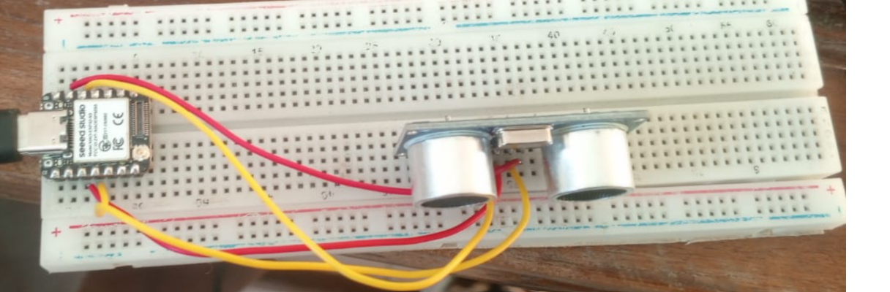

# journal du 03 Sept 2026
## PROGRAMMATON
- révision sur l'algorithmique
- introduction sur le langage python
- Qu'est ce que python ?
- les caractéristiques de  python 
- les notions de bases à apprendre (afficher un résultat;varibles;types de données;opérateurs;entrée d'utilisateur;boucles;foctions;commentaires)
- Les types de données de base
- Quelques exercices de base pour la mise en pratique des notions de base de la programmation
- les notion input et print
## SUR LE PROJET
- continuité sur le prototypage de notre projet ; essai de cablage du ESP32 à un capteur-ultrason
;
- modification de notre cahier de charges en remplaçant ou en y ajoutant certains outils les plus adaptés au projets
