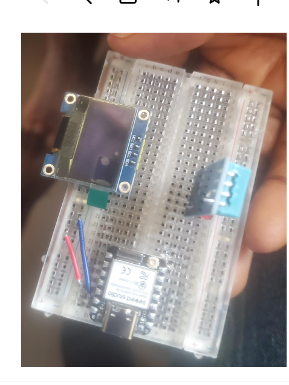

# journal du 05 Septembre 2026
 ## FAIT AUJOURD'HUI
 - un TP  SUR ** Smart weather ** , une station météorolique à l'aide des composants tels qu'un capteur  d'humodité et de température , un écran OLED et un ESP32'S3
- 
 ## APPRIS 
 - comment éffectuer les connexions sur un breadboard et comment connecter les bronches et chaque composant afin d'obtenir le résultat escompter
 ' utilisation de l'éditeur de code **Thony** pour exécuter le programme 
 ## Raté et revu
 - une erreur de connexion entre les éléments électroniques mais j'ai su très tôt pour l'arranger
 ## Décidé
 - m'exercer en regardant des tutoriels qui permettent de cerner d'avantage ce qui est fait
