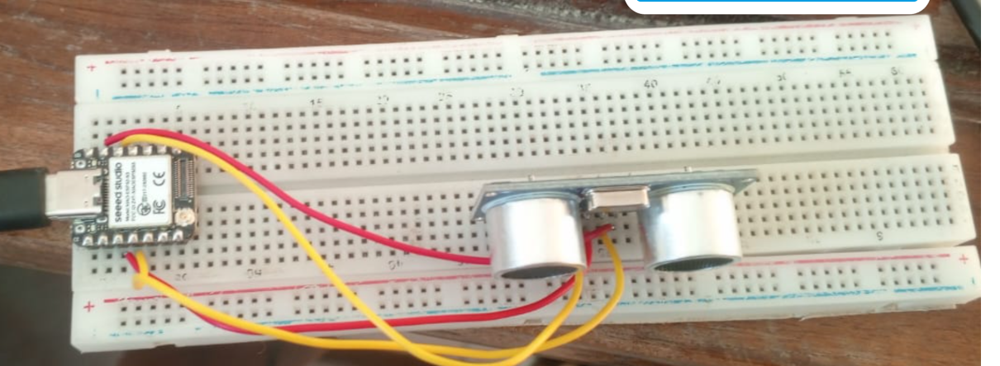

# Journal du 08 septembre 2026
## CE QU'ON A FAIT
- Conception d'une pièce usinée 3D 
- définiton de la FAO
- le flux du travail(la conception-la programmation- la simulatin-fabrication -contrôle de qualité)
- machine CNC(fraisage,tornage,découpe,routage)
- fusion 360(designe,manifacture;simulatin;drawing)
- synthèse et le pourquoi utilisé la FAO dans fusion 360
## projet
- Réalisatin du premier prototype du distributeur automatique de savon liquide 
- Revue des matériels néccésaires au projet
- Revue du cahier de charges 
- Essai du premier calibrage du ESP32+un capteur ultr-aso

## La programmatin
- la programmation du ESP32:non réussite
- schéma mal calibré dans l'ensemble
## Ce que l'on devrait faire 
- corriger le calibrage et construire un bon programme pour le ESP32

