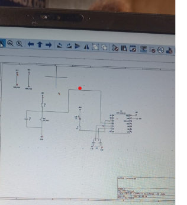

# journal du 09septembre 2026
- Projet d'allumage d'une LED JAVA
. Définission du circuit
. Créer un projet Kicad
. Déssiner le schéma électrique
. Associer les empreintes 
. Créer le PCB
. Placer les composants 
. Vérifier le PCB
. visualiser les fichier

## ce que j'ai fait et ce que je n'ai pas réussi à faire 
- j'ai réussi à faire du debut jusqu'à la fin le Projet
- je n'ai pu le faiseul
## ce que devrait faire 
- c'est de mexercer
- demander l'aide aux collègue si je ne comprends pas 