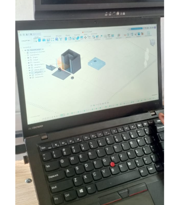
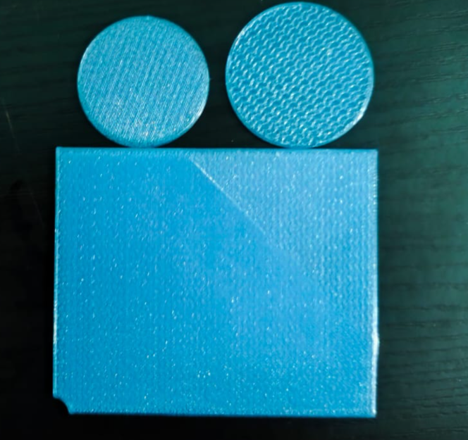

# journal du 10 Septembre 2026
# FAIT AUJPOURD'HUI
- calibrage du ESP32+capteur ultra-son en présence d'une LED et une résistance
- constructin d'un programme python permettant le bon fonctionnement de tout le dispositif de pompage de savon liquide 
- modélisation de nos différentes boîtes qui contiendront  les éléments électriques d'une part et le savon liquide d'autre part

- lancement de l'impression de ces diff'rentes boîtes
# ce qui a marché/ce qui n'a pas marché
- le calibrage ; la modélisation et la programmation ont tous marché
- l'impresssion n'a pas abouti par ce que la machine s'est arrêtée et que les autres machines étaient toutes occupées

