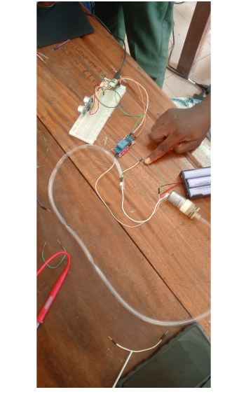

# journal du 12 septembre 2026
## fait aujourd'hui
- tentative de réalisation du PCB
- cablage et communication de nos différents élements sur le breadboard
- achat du recipient et remodélisation du support qui contiendra et le récipient ,la pompe et tous les autre éléments electroniques

## appris
- maîtrise de réalisation d'un circuit électrique sur le Kicad 
- comment coonecter un pompe de 12V avec les différents composants du circuit electriques
## Raté puis corrigé 
     NEANT  
## décidé
- couper notre propre boîtier avec la découpe laser
- ne plus faire PCB mais utiliser un autre composant à la place du PCB