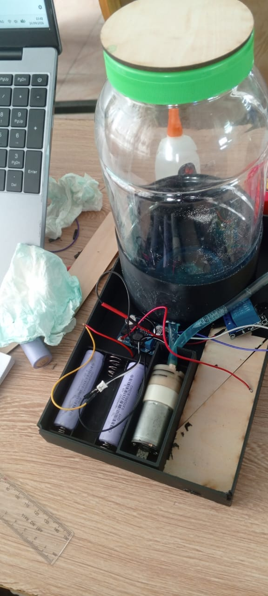

# journal du 16 Septembre 2026
## fait aujourd'hui
- finission du cablage et test du fonctionctionnement de tous les éléments 
- modélisatin d'un objet pour couvrir après l'impressoion sur la partie visible de la partie électronique 
debut de la rédaction de notre documentation
## appris
- le  principe fonctionnement du module de relais 
NB: le module de relais fonctione comme un interrupteur
## raté et coorigé
- mauvaise connexion entre le module de relais et la motopompe
## décider
- continuer le design sur le boîtier
- continuer la documentation

