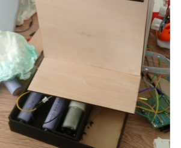

# journal du 16 Septembre 2026
## fait aujourd'hui
- finission du cablage et test du fonctionctionnement de tous les éléments

- modélisatin d'un objet pour couvrir après l'impressoion sur la partie visible de la partie électronique 
debut de la rédaction de notre documentation

