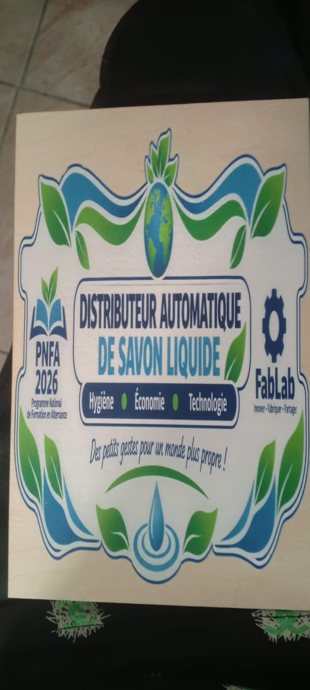
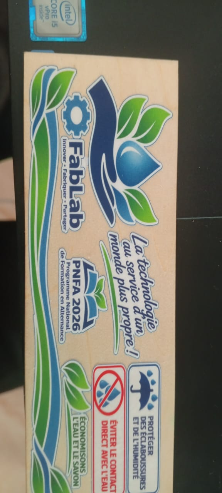
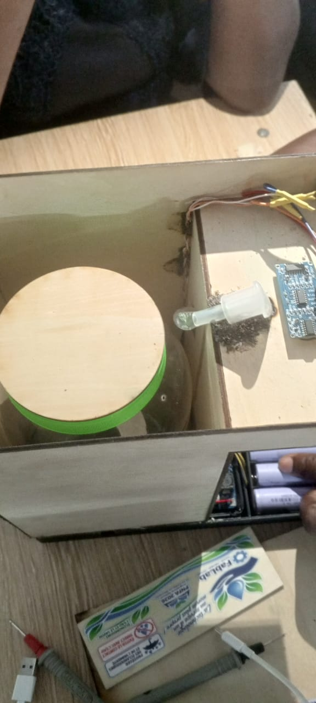

# journal du 17 septembre 2026
## fait aujoord'hui
- impression des images instructives et sensibilatrices sur DTF,histoire de designer notre boîtier et montrer où plçer la main pour reccueillir le savon liquide  ,
- raccordement de certains fils coupés
- introduction de l'interrupteur afin de couper manuellement le fonctionnement
- De nouvelles mises à jour de notre programmaton (changer le temps de pompage du savon,distance qu'il faudrait pour activer la pompe,le temps qui sépare deux actions de pompe)
- Ensemblage de tout,,
## appris
- comment placer un interrupteur en pratique sur ce modèl de circuit
- comment faire la découpe du contre plaqué avec xtool
- entretien de notre circuit 
## raté et cooriger
- lors du test notre pompe fonctionne et sarrête seule bref le circuit coupait sans être arrêter;cause: il y'a eu une corrosion entre les joins du générateur de celui du relais du coup du coup les fils bougeaient;anomalie détectée puis corrigée
- le temps de pompage était de trois secondes et nous avons remarqué que savon sortait assez donc le temps a été réduis de trois secondes à 400 millisecondes
## décidé
- poser le couvercle demain(partie à ouvrir afin de verser le savon liquide)
- mettre la résine sur la partie quoi couvre la partie électronique

