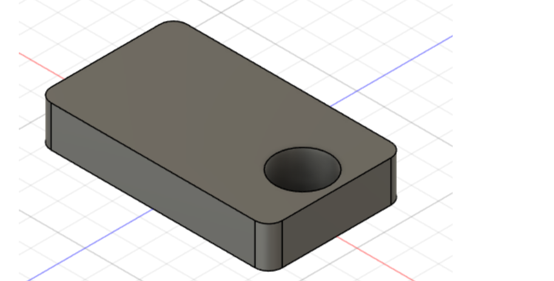

#  journal du 01-09-2026.md
## CE QU'ON A FAIT
   . IMPRESSION DTF
   - Contenu(définition/principe/avantage et limites/présentation de l'impression DTF)
   - Préparation du fichier(péparation une image destinée à l'impression/comprendre la notion de résolution/prépararer correctement le motif pour l'impression)
   - Comment fonctionne l'imprimante DTF (identifier les principaux élements de l'imprimante/Role de différentes encres/Cheminement du film )
   - Impression sur le film DTF(charger correctement le film/lancer l'impression / Controlerla qualité de l'impression)
    .ATELIERELECTRONIQUE
    - Réalisation pratique des circuits électriques comportant : un générateur,une LED et une resistance; un générateur,deux LED et deux resistances;un transistor,deux LED et une résistance
    .FUSION 3D 
    - continuité du cours fusion 3D
    - Nous avons appris à réaliser un projet avec l'aide du formateur 
    - chacun de nous a réalisé une pièce comportant son nom 
    

